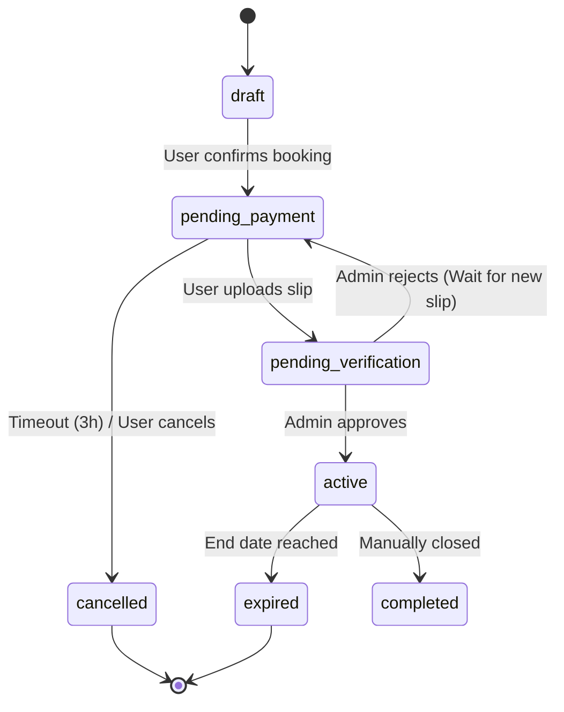

# คู่มือการพัฒนาระบบเช่าล็อคตลาด (Developer Implementation Guide)

## ภาพรวม

คู่มือนี้ออกแบบมาสำหรับนักพัฒนาที่จะพัฒนาระบบเช่าล็อคตลาดตามแผนที่วางไว้ แบ่งเป็น 4 phases พร้อม timeline และ checklist โดยละเอียด

**รอบการพัฒนา**: 8 สัปดาห์  
**ทีม**: 2-3 developers

---

## ข้อสันนิษฐานและข้อจำกัด (System Assumptions & Limitations)

เพื่อให้ผู้พัฒนาและผู้บริหารเข้าใจขอบเขตของระบบในเวอร์ชันปัจจุบัน:
- **Small-to-Medium Segment**: ระบบออกแบบมาเพื่อจัดการตลาดที่มีจำนวนแผงและปริมาณการจองระดับเล็กถึงกลาง
- **Date-based Complexity**: เลือกใช้การจองแบบระบุวันที่ (Date-based) แทนการระบุเวลาเป็นวินาที เพื่อความเสถียรและลดปัญหาเรื่องเขตเวลา (Time-zone)
- **Temporary Lock Status**: การใช้ `Lock.status` (booked/available) เป็นการตัดสินใจในช่วงเริ่มต้นเพื่อความรวดเร็ว ในอนาคตควรเปลี่ยนไปใช้การคำนวณจาก Booking Timeline
- **Fixed Pricing**: ปัจจุบันยังไม่รองรับระบบ Dynamic Pricing ที่เปลี่ยนตามฤดูกาล หรือโปรโมชันซ้อนระดับความซับซ้อนสูง

---

## Technical Stack & Tools (Current)

- **Framework**: Next.js 16 (App Router)
- **UI Framework**: Bootstrap 5.3 + React Bootstrap
- **Icons**: Bootstrap Icons
- **Database**: MongoDB + Mongoose
- **Auth**: NextAuth.js v5 (Beta)
- **Validation**: Zod + React Hook Form
- **Scripting**: tsx (for running TypeScript scripts)
- **Styling**: Vanilla CSS / SCSS

---

## Phase 1: Foundation Setup (สัปดาห์ 1-2) - **Completed**

### Week 1: Project Setup & Database

#### Day 1-2: Initialize Project
```bash
# สร้าง Next.js project
npx create-next-app@latest ./ --typescript --app --no-tailwind

# ติดตั้ง dependencies สำหรับ UI
npm install bootstrap react-bootstrap sass bootstrap-icons
npm install --save-dev @types/react-bootstrap

# ติดตั้ง dependencies หลักอื่นๆ
npm install mongoose next-auth@beta bcryptjs zod react-hook-form @hookform/resolvers dotenv
npm install -D @types/bcryptjs tsx
```

**Checklist**:
- [x] Setup Git repository
- [x] Configure `.gitignore`
- [x] Create folder structure (Admin, API, Models, Lib)
- [x] Setup SCSS and Bootstrap integration

#### Day 3-4: MongoDB & Admin Seeding
**Environment Variables** (`.env`):
```env
# Database (รองรับทั้ง MONGO_URL และ MONGODB_URI)
MONGO_URL=mongodb://...
MONGODB_URI=mongodb://...

# Auth
NEXTAUTH_URL=http://localhost:3000
NEXTAUTH_SECRET=your-secret

# Cloudinary
CLOUDINARY_CLOUD_NAME=...
CLOUDINARY_API_KEY=...
CLOUDINARY_API_SECRET=...

# Initial Admin (ใช้สำหรับรัน script seed-admin)
ADMIN_NAME="Admin Market"
ADMIN_USERNAME=admin@markethub.com
ADMIN_PASSWORD=your-secure-password
```

**Seed Admin Script** (`scripts/seed-admin.ts`):
ใช้สำหรับสร้าง SuperAdmin คนแรกเข้าฐานข้อมูล
```bash
npm run seed-admin
```

**Checklist**:
- [x] MongoDB Atlas cluster created
- [x] Connection successful (Mongoose singleton setup)
- [x] `.env` configured with admin credentials
- [x] Admin seed script implemented and verified


#### Day 5-7: Create Mongoose Models

**User Model** (`/models/User.ts`):
```typescript
interface IUser {
  email: string;
  password: string;
  name: string;
  role: 'user' | 'staff' | 'admin' | 'superadmin'; // เพิ่มสิทธิ์ staff
  isActive: boolean;
  // ... rest of fields
}
```

**สร้างทั้งหมด 8 models**:
- [x] User
- [x] Zone (ดึงข้อมูลพื้นฐาน)
- [x] Lock (ดึงข้อมูลพื้นฐาน)
- [ ] Booking
- [ ] Payment
- [ ] InterestList
- [ ] Notification
- [ ] Refund

### Week 2: Authentication & RBAC

#### Day 1-3: NextAuth.js v5 Setup (Beta)

**Auth Logic** (`/lib/auth/auth.ts`):
เราใช้ NextAuth v5 ที่รองรับ Middleware และ Edge Runtime โดยแยกส่วน Config ออกมา

**Auth Config** (`/lib/auth/auth.config.ts`):
```typescript
import { canAccessAdminPanel } from './permissions';

export const authConfig = {
  callbacks: {
    authorized({ auth, request: { nextUrl } }) {
      const isLoggedIn = !!auth?.user;
      const role = auth?.user?.role;
      const canAccessAdmin = canAccessAdminPanel(role);
      
      const isOnAdminPanel = nextUrl.pathname.startsWith('/admin');
      
      if (isOnAdminPanel) {
        if (!isLoggedIn) return Response.redirect(new URL('/admin/login', nextUrl));
        if (!canAccessAdmin) return Response.redirect(new URL('/', nextUrl));
        return true;
      }
      return true;
    },
    async jwt({ token, user }) {
      if (user) { token.role = user.role; token.id = user.id; }
      return token;
    },
    async session({ session, token }) {
      if (session.user) { 
        session.user.role = token.role; 
        session.user.id = token.id; 
      }
      return session;
    },
  },
  providers: [], // Configure in auth.ts
} satisfies NextAuthConfig;
```

**Checklist**:
- [x] NextAuth.js v5 configured
- [x] Separate Login pages (/login, /admin/login)
- [x] Role-Based Access Control (RBAC) System
- [x] Middleware protection for admin routes


#### Day 4-5: UI Components

**Login Form** (ตัวอย่างใช้ React Hook Form + Zod):
```typescript
'use client';

import { useForm } from 'react-hook-form';
import { zodResolver } from '@hookform/resolvers/zod';
import { z } from 'zod';
import { signIn } from 'next-auth/react';
import { Form, Button, Alert, Container, Card } from 'react-bootstrap';

const loginSchema = z.object({
  email: z.string().email('อีเมลไม่ถูกต้อง'),
  password: z.string().min(8, 'รหัสผ่านต้องมีอย่างน้อย 8 ตัวอักษร'),
});

type LoginFormData = z.infer<typeof loginSchema>;

export default function LoginForm() {
  const { register, handleSubmit, formState: { errors } } = useForm<LoginFormData>({
    resolver: zodResolver(loginSchema),
  });

  const onSubmit = async (data: LoginFormData) => {
    const result = await signIn('credentials', {
      email: data.email,
      password: data.password,
      redirect: true,
      callbackUrl: '/locks',
    });
  };

  return (
    <Container className="py-5">
      <Card className="mx-auto" style={{ maxWidth: '400px' }}>
        <Card.Body>
          <h2 className="text-center mb-4">เข้าสู่ระบบ</h2>
          <Form onSubmit={handleSubmit(onSubmit)}>
            <Form.Group className="mb-3">
              <Form.Label>อีเมล</Form.Label>
              <Form.Control 
                type="email" 
                {...register('email')} 
                isInvalid={!!errors.email}
              />
              <Form.Control.Feedback type="invalid">
                {errors.email?.message}
              </Form.Control.Feedback>
            </Form.Group>

            <Form.Group className="mb-4">
              <Form.Label>รหัสผ่าน</Form.Label>
              <Form.Control 
                type="password" 
                {...register('password')} 
                isInvalid={!!errors.password}
              />
              <Form.Control.Feedback type="invalid">
                {errors.password?.message}
              </Form.Control.Feedback>
            </Form.Group>

            <Button variant="primary" type="submit" className="w-100">
              เข้าสู่ระบบ
            </Button>
          </Form>
        </Card.Body>
      </Card>
    </Container>
  );
}
```

**Checklist**:
- [ ] Login/Register forms with validation
- [ ] Error handling UI
- [ ] Loading states
- [ ] Responsive design (mobile-first)

---

## Phase 2: Core Features (สัปดาห์ 3-5) - **In Progress**
### UI & Localization (Updated)
**สำคัญ**: เพื่อให้ระบบเข้าถึงผู้ใช้ทุกวัย (25 - 60+ ปี) อินเทอร์เฟซทั้งหมดจะถูกปรับเป็น **ภาษาไทย** ที่เข้าใจง่ายและใช้ฟอนต์ **Noto Sans Thai** ที่อ่านง่าย

### Admin Security & RBAC
เราใช้ระบบ **Role-Based Access Control (RBAC)** ร่วมกับ NextAuth v5 middleware เพื่อแยกสิทธิ์การใช้งานที่ชัดเจน

#### 1. สิทธิ์การใช้งาน (Permissions)
`/lib/auth/permissions.ts` กำหนดสิทธิ์:
- `superadmin`: สิทธิ์สูงสุด (จัดการพนักงานระบบได้)
- `admin`: จัดการทีมงาน, พื้นที่เช่า, และการจอง
- `staff`: จัดการพื้นที่เช่าและการจอง (แก้ไขพนักงานไม่ได้)
- `user`: ผู้เช่าทั่วไป

#### 2. การป้องกันเส้นทาง (Route Protection)
ใช้ `callbacks.authorized` ใน `auth.config.ts` เพื่อเช็คสิทธิ์ `canAccessAdminPanel` ก่อนเข้าหน้า `/admin/*`

---

### Week 3: Admin Management & Dashboard

#### Day 1-2: Admin Dashboard & Staff Management
**หน้า Dashboard (`/admin/dashboard`)**: 
- แสดงสถิติภาพรวม: ล็อคทั้งหมด, ล็อคว่าง, จองแล้ว, จำนวนพนักงาน
- พัฒนา API `/api/admin/stats` เพื่อดึงข้อมูล Real-time

**จัดการพนักงาน (`/admin/staff`)**:
- CRUD API `/api/admin/staff` สำหรับดึงและเพิ่มพนักงาน
- หน้าจอ UI ใช้ React Bootstrap Modal สำหรับฟอร์มเพิ่มพนักงาน

#### Day 3-5: Admin Lock & Zone Management (Next Step)
**API Routes**:
- `POST /api/admin/locks` - เพิ่มล็อค (Protect with `manage_locks` permission)
- `GET /api/admin/locks` - รายการล็อคทั้งหมด
- `POST /api/admin/zones` - เพิ่มโซน (Protect with `manage_zones` permission)

**Checklist**:
- [x] RBAC System (Permissions helper)
- [x] Separate Admin Login UI (Thai)
- [x] Staff Management (List & Create)
- [x] Admin Dashboard (Basic Stats)
- [ ] Lock CRUD UI
- [ ] Zone CRUD UI
- [ ] Image upload to Cloudinary (Integration)


#### Day 3-5: User Lock Browsing

**Features**:
- Grid view และ Map view (ใช้ `react-leaflet` หรือ `mapbox-gl`)
- Bootstrap Grid (`Row`, `Col`) สำหรับ Card layout
- Filter (zone, size, price) - ใช้ `Form.Select` และ `Form.Check`
- Search bar - ใช้ `InputGroup`
- Lock detail page พร้อม image gallery

**Availability Calendar**:
```typescript
// /components/AvailabilityCalendar.tsx
import { useState, useEffect } from 'react';
import { Calendar } from 'react-calendar';

export default function AvailabilityCalendar({ lockId }) {
  const [bookedDates, setBookedDates] = useState([]);

  useEffect(() => {
    fetch(`/api/locks/${lockId}/availability`)
      .then(res => res.json())
      .then(data => setBookedDates(data.bookedDates));
  }, [lockId]);

  const tileDisabled = ({ date }) => {
    return bookedDates.some(bookedDate =>
      date >= new Date(bookedDate.startDate) &&
      date <= new Date(bookedDate.endDate)
    );
  };

  return <Calendar tileDisabled={tileDisabled} />;
}
```

**Checklist**:
- [ ] Lock listing page
- [ ] Lock detail page
- [ ] Availability calendar
- [ ] Filter & search functionality
- [ ] Responsive image gallery

### Week 4-5: Booking System

#### 1. นิยามด้านเวลาและการจอง (Booking Time Definitions)
เพื่อให้ระบบมีความยุติธรรมและลดความซับซ้อนของ Time-zone:
- **startDate**: วันที่เริ่มใช้งานจริง (เริ่มที่เวลา 00:00:00 ของวันนั้น)
- **endDate**: วันสุดท้ายของการใช้งาน (สิ้นสุดที่เวลา 23:59:59 ของวันนั้น)
- **การคำนวณ**: ใช้ Date-based สำหรับรายวัน/รายสัปดาห์/รายเดือน

#### 2. Booking State Machine
สถานะการจองต้องเป็นไปตามขั้นตอนที่กำหนด (Explicit Transitions):



**กฎการเปลี่ยนสถานะ (Rules):**
- ❌ `active` --> `cancelled` (ไม่อนุญาต - ต้องผ่านกระบวนการคืนเงิน/ยกเลิกพิเศษ)
- ❌ `expired` --> `paid` (ไม่อนุญาต)
- ✅ `cancelled` ได้เฉพาะในช่วงก่อนเป็น `active` เท่านั้น

#### 3. Design Decision: Lock Status vs. Availability
> [!NOTE]
> **ปัจจุบัน**: เราใช้ `Lock.status = 'booked' | 'available'` เพื่อความรวดเร็วในการพัฒนาช่วงแรก
> **ข้อควรระวัง (Design Decision)**: ในอนาคต `Lock` ควรทำหน้าที่แค่บอกสถานะทางกายภาพ (เช่น `active` | `maintenance`) ส่วน "ความว่าง" (Availability) ควรถูกคำนวณจาก `Booking` ในช่วงเวลาที่เลือก เพื่อให้ล็อคหนึ่งสามารถมีหลายการจองล่วงหน้าได้
>
> **Future Improvement (Roadmap)**:
> - [ ] Remove `Lock.status = booked`
> - [ ] Calculate availability purely from Booking collection
> - [ ] Enable advance booking for same lock (ซ้อนกันได้ถ้าไม่ชนเวลา)

#### 4. Booking Flow Implementation

**1. Create Booking API** (`/app/api/bookings/route.ts`):
```typescript
import { NextRequest, NextResponse } from 'next/server';
import mongoose from 'mongoose';
import connectDB from '@/lib/db/mongoose';
import Booking from '@/models/Booking';
import Lock from '@/models/Lock';

export async function POST(req: NextRequest) {
  const session = await mongoose.startSession();
  session.startTransaction();

  try {
    await connectDB();
    const { lockId, startDate, endDate, rentalType } = await req.json();

    // 1. Check overlapping bookings
    const overlap = await Booking.findOne({
      lock: lockId,
      status: { $in: ['pending_payment', 'pending_verification', 'active'] },
      $or: [
        { startDate: { $lte: new Date(endDate) }, endDate: { $gte: new Date(startDate) }}
      ]
    }).session(session);

    if (overlap) {
      throw new Error('Lock is not available for selected period');
    }

    // 2. Lock the lock (pessimistic locking)
    const lock = await Lock.findOneAndUpdate(
      { _id: lockId, status: 'available' },
      { status: 'booked' },
      { session, new: true }
    );

    if (!lock) {
      throw new Error('Lock is no longer available');
    }

    // 3. Create booking
    const paymentDeadline = new Date(Date.now() + 3 * 60 * 60 * 1000); // 3 hours
    
    // Note: session.user มาจาก auth middleware (inject ผ่าน helper function หรือ auth())
    const booking = await Booking.create([{
      user: session.user.id,
      lock: lockId,
      startDate,
      endDate,
      rentalType,
      totalAmount: calculateTotal(lock, startDate, endDate, rentalType),
      status: 'pending_payment',
      paymentDeadline,
    }], { session });

    await session.commitTransaction();
    return NextResponse.json(booking[0], { status: 201 });

  } catch (error) {
    await session.abortTransaction();
    return NextResponse.json({ error: error.message }, { status: 400 });
  } finally {
    session.endSession();
  }
}
```

**2. Payment Upload with Cloudinary**:
```typescript
// /app/api/payments/upload/route.ts
import { v2 as cloudinary } from 'cloudinary';
import crypto from 'crypto';

cloudinary.config({
  cloud_name: process.env.CLOUDINARY_CLOUD_NAME,
  api_key: process.env.CLOUDINARY_API_KEY,
  api_secret: process.env.CLOUDINARY_API_SECRET,
});

export async function POST(req: NextRequest) {
  const formData = await req.formData();
  const file = formData.get('slip') as File;

  // Validate file
  if (!file || file.size > 5 * 1024 * 1024) {
    return NextResponse.json({ error: 'File too large' }, { status: 400 });
  }

  // Generate hash for duplicate detection
  const buffer = Buffer.from(await file.arrayBuffer());
  const hash = crypto.createHash('sha256').update(buffer).digest('hex');

  // Check duplicate
  const existing = await Payment.findOne({ slipHash: hash });
  if (existing) {
    return NextResponse.json({ error: 'Slip already used' }, { status: 400 });
  }

  // Upload to Cloudinary
  const result = await cloudinary.uploader.upload(
    `data:${file.type};base64,${buffer.toString('base64')}`,
    {
      folder: 'payment-slips',
      resource_type: 'auto',
    }
  );

  // OCR processing (Optional / Helper)
  // Note: OCR ใช้เพื่อช่วยตรวจสอบเบื้องต้น (Fill-in) การตัดสินใจสุดท้ายยังคงเป็น Human-in-the-loop
  const ocrResult = await processOCR(result.secure_url);

  // Save payment
  const payment = await Payment.create({
    booking: bookingId,
    user: session.user.id,
    slipImage: result.secure_url,
    slipHash: hash,
    ocrResult,
    status: 'pending',
  });

  return NextResponse.json(payment);
}
```

**3. Payment Timeout Cron Job**:
```typescript
// /app/api/cron/cancel-expired-bookings/route.ts
export async function GET(req: NextRequest) {
  // Verify cron secret
  if (req.headers.get('Authorization') !== `Bearer ${process.env.CRON_SECRET}`) {
    return NextResponse.json({ error: 'Unauthorized' }, { status: 401 });
  }

  await connectDB();
  const now = new Date();

  // Find expired bookings
  const expiredBookings = await Booking.find({
    status: 'pending_payment',
    paymentDeadline: { $lt: now },
  });

  // Cancel and release locks
  for (const booking of expiredBookings) {
    // Idempotent guard
    if (booking.status !== 'pending_payment') continue;

    booking.status = 'cancelled';
    booking.cancelledAt = now;
    booking.cancellationReason = 'Payment timeout';
    await booking.save();

    // Release lock
    await Lock.findByIdAndUpdate(booking.lock, { status: 'available' });
  }

  return NextResponse.json({ cancelled: expiredBookings.length });
}
```

**Setup Vercel Cron** (`vercel.json`):
```json
{
  "crons": [
    {
      "path": "/api/cron/cancel-expired-bookings",
      "schedule": "*/15 * * * *"
    },
    {
      "path": "/api/cron/send-renewal-notifications",
      "schedule": "0 * * * *"
    }
  ]
}
```

**Checklist**:
- [ ] Booking creation with transaction
- [ ] Overlap detection
- [ ] Payment upload to Cloudinary
- [ ] OCR processing (Tesseract.js)
- [ ] Payment verification UI (Admin)
- [ ] Cron jobs for timeout (Idempotent check)
- [ ] Rate limiting:
    - User: Max 3 `pending_payment` bookings at the same time
    - User: Max 5 total bookings per user (Limit to prevent spam/scalping)

---

## Phase 3: Advanced Features (สัปดาห์ 6-7)

### Week 6: Notification System (Refined: Event-based)

เราปรับปรุงระบบแจ้งเตือนให้เป็นแบบ **Event-based Architecture** โดยมี `NotificationService` เป็นตัวกลาง (Dispatcher) เพื่อจัดการทั้ง In-App Notification (Database) และ Email Notification

#### 1. Notification Model (`models/Notification.ts`)
```typescript
import mongoose, { Schema, Document } from 'mongoose';

export interface INotification extends Document {
  user: mongoose.Types.ObjectId;
  type: 'booking_created' | 'payment_uploaded' | 'booking_approved' | 'booking_rejected' | 'booking_cancelled' | 'booking_expiring' | 'system';
  title: string;
  message: string;
  link?: string;
  isRead: boolean;
  createdAt: Date;
}

const notificationSchema = new Schema<INotification>({
  user: { type: Schema.Types.ObjectId, ref: 'User', required: true },
  type: { type: String, required: true },
  title: { type: String, required: true },
  message: { type: String, required: true },
  link: { type: String },
  isRead: { type: Boolean, default: false },
}, { timestamps: true });

notificationSchema.index({ user: 1, isRead: 1, createdAt: -1 });

export default mongoose.models.Notification || mongoose.model<INotification>('Notification', notificationSchema);
```

#### 2. Notification Service (`lib/notification/service.ts`)
ทำหน้าที่เป็น Dispatcher กลาง ไม่เรียก Email Service ตรงๆ จาก Controller

```typescript
export const NotificationService = {
  async send(userId: string, type: NotificationType, data: any) {
    // 1. Create In-App Notification (Always)
    await createInAppNotification(userId, type, data);

    // 2. Send Email (Conditional based on policy)
    if (shouldSendEmail(type)) {
      await sendEmailNotification(userId, type, data);
    }
  }
};
```

#### 2.1 Notification Policy

| Event | In-App | Email |
|------|--------|-------|
| booking_created | ✅ | ✅ |
| payment_uploaded | ❌ | ❌ |
| booking_approved | ✅ | ✅ |
| booking_expiring | ✅ | ✅ |
```

#### 3. API Endpoints
- **GET** `/api/notifications`: ดึงรายการแจ้งเตือนล่าสุด
- **PATCH** `/api/notifications/[id]/read`: อ่านรายการเดียว
- **PATCH** `/api/notifications/read-all`: อ่านทั้งหมด

#### 4. Renewal Notification Cron
ปรับปรุงให้เรียกผ่าน `NotificationService`

```typescript
// /app/api/cron/send-renewal-notifications/route.ts
// ...
  for (const booking of expiringBookings) {
    await NotificationService.send(booking.user.id, 'booking_expiring', booking);
    booking.renewalNotificationSent = true;
    await booking.save();
  }
// ...
```

**Checklist**:
- [x] Create Notification Model
- [x] Implement NotificationService (Dispatcher)
- [x] Create API Endpoints (Get, Read, ReadAll)
- [x] UI Components (Bell, Notification List)
- [x] Refactor Booking/Payment APIs to use NotificationService
- [x] Renewal Cron Job Integration

### Week 7: Analytics Dashboard

#### Admin Dashboard คอมโพเนนต์

**Revenue Chart** (ใช้ `recharts`):
```typescript
import { LineChart, Line, XAxis, YAxis, CartesianGrid, Tooltip } from 'recharts';

export default function RevenueChart({ data }) {
  return (
    <LineChart width={600} height={300} data={data}>
      <CartesianGrid strokeDasharray="3 3" />
      <XAxis dataKey="date" />
      <YAxis />
      <Tooltip />
      <Line type="monotone" dataKey="revenue" stroke="#8884d8" />
    </LineChart>
  );
}
```

**Checklist**:
- [ ] Revenue dashboard
- [ ] Occupancy rate analytics
- [ ] Popular zones heatmap
- [ ] User statistics
- [ ] Export reports (PDF/Excel)

---

## Phase 4: Testing & Deployment (สัปดาห์ 8)

### Week 8, Day 1-3: Testing

#### Unit Tests
```bash
npm install -D jest @testing-library/react @testing-library/jest-dom
```

**Test Example**:
```typescript
// __tests__/lib/utils/calculateTotal.test.ts
import { calculateTotal } from '@/lib/utils/booking';

describe('calculateTotal', () => {
  it('should calculate daily rental correctly', () => {
    const lock = { pricing: { daily: 100, weekly: 600, monthly: 2000 } };
    const total = calculateTotal(lock, '2024-01-01', '2024-01-03', 'daily');
    expect(total).toBe(200); // 2 days
  });
});
```

#### Integration Tests
```typescript
// __tests__/api/bookings.test.ts
import { POST } from '@/app/api/bookings/route';

describe('/api/bookings', () => {
  it('should prevent overlapping bookings', async () => {
    // Test booking overlap scenario
  });
});
```

**Checklist**:
- [ ] Unit tests (80%+ coverage)
- [ ] Integration tests
- [ ] E2E tests (Playwright)
- [ ] Load testing (k6)

### Week 8, Day 4-5: Deployment

#### Vercel Deployment
```bash
# Install Vercel CLI
npm i -g vercel

# Deploy to preview
vercel

# Deploy to production
vercel --prod
```

**Environment Variables** (Vercel Dashboard):
- Add all `.env.local` variables
- Enable Vercel Cron Jobs
- Configure custom domain

**Checklist**:
- [ ] Deploy to Vercel
- [ ] Configure MongoDB Atlas production cluster
- [ ] Setup Cloudinary production
- [ ] Configure custom domain + SSL
- [ ] Setup monitoring (Sentry, Vercel Analytics)
- [ ] Backup verification

---

## Testing Checklist

### Manual Testing Scenarios
1. **User Flow**:
   - [ ] Register → Verify Email → Login
   - [ ] Browse locks → Filter by zone
   - [ ] View lock detail → Check calendar
   - [ ] Book lock → Upload slip → OCR reads correctly
   - [ ] Admin approves → Receive confirmation email

2. **Edge Cases**:
   - [ ] Two users book same lock simultaneously → One fails
   - [ ] Upload duplicate slip → Error message
   - [ ] Payment timeout → Booking cancelled
   - [ ] OCR confidence <80% → Manual editing works
   - [ ] Renewal flow: 3-hour notice → Renew successfully

3. **Admin Flow**:
   - [ ] Create/Edit/Delete locks
   - [ ] Verify payments (Approve/Reject)
   - [ ] View analytics dashboard
   - [ ] Process refund requests

---

## Deployment Checklist

### Pre-deployment
- [ ] All tests passing
- [ ] No console.errors in production build
- [ ] Environment variables configured
- [ ] Database indexes created
- [ ] Cloudinary folders organized

### Post-deployment
- [ ] SSL certificate active
- [ ] Cron jobs running (check logs)
- [ ] Email sending works
- [ ] OCR processing works
- [ ] Monitoring active (Sentry)
- [ ] Backup running daily

### Performance Targets
- [ ] First Contentful Paint < 1.5s
- [ ] Time to Interactive < 3s
- [ ] API response time < 500ms (95th percentile)
- [ ] Lighthouse score > 90

---

## Maintenance & Monitoring

### Daily
- [ ] Check error logs (Sentry)
- [ ] Verify cron jobs ran successfully
- [ ] Monitor payment verification queue

### Weekly
- [ ] Review analytics (user growth, revenue)
- [ ] Check database backup
- [ ] Update dependencies (security patches)

### Monthly
- [ ] Performance audit
- [ ] User feedback review
- [ ] Feature prioritization

---

## ทรัพยากรเพิ่มเติม

- **Bootstrap Docs**: https://getbootstrap.com/docs/5.3/
- **React Bootstrap**: https://react-bootstrap.netlify.app/
- **Bootstrap Icons**: https://icons.getbootstrap.com/
- **Next.js Docs**: https://nextjs.org/docs
- **MongoDB Atlas**: https://www.mongodb.com/docs/atlas/
- **NextAuth.js**: https://next-auth.js.org/
- **Cloudinary**: https://cloudinary.com/documentation
- **Tesseract.js**: https://tesseract.projectnaptha.com/

---

**หมายเหตุ**: คู่มือนี้เป็นแนวทางทั่วไป สามารถปรับแต่งตามความเหมาะสมของทีมและโปรเจกต์
